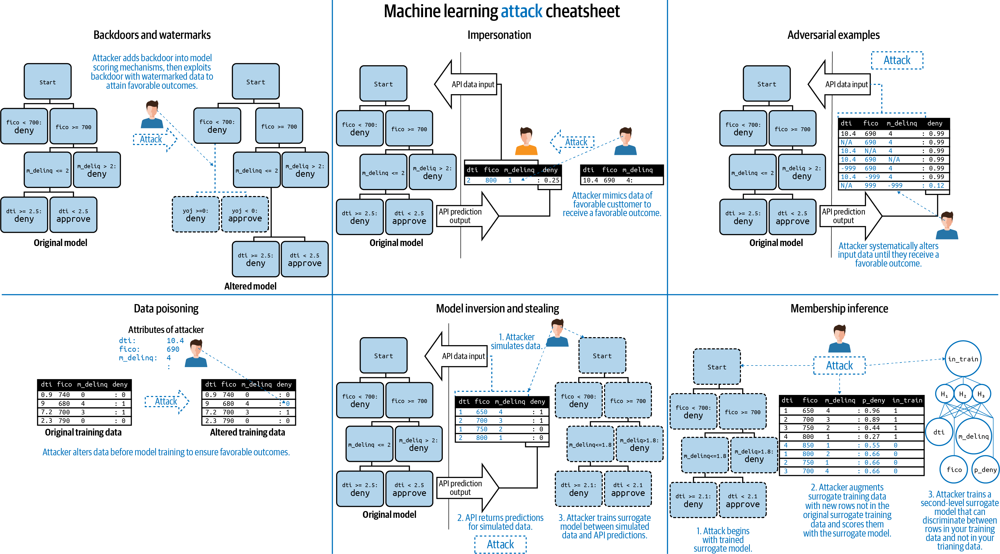
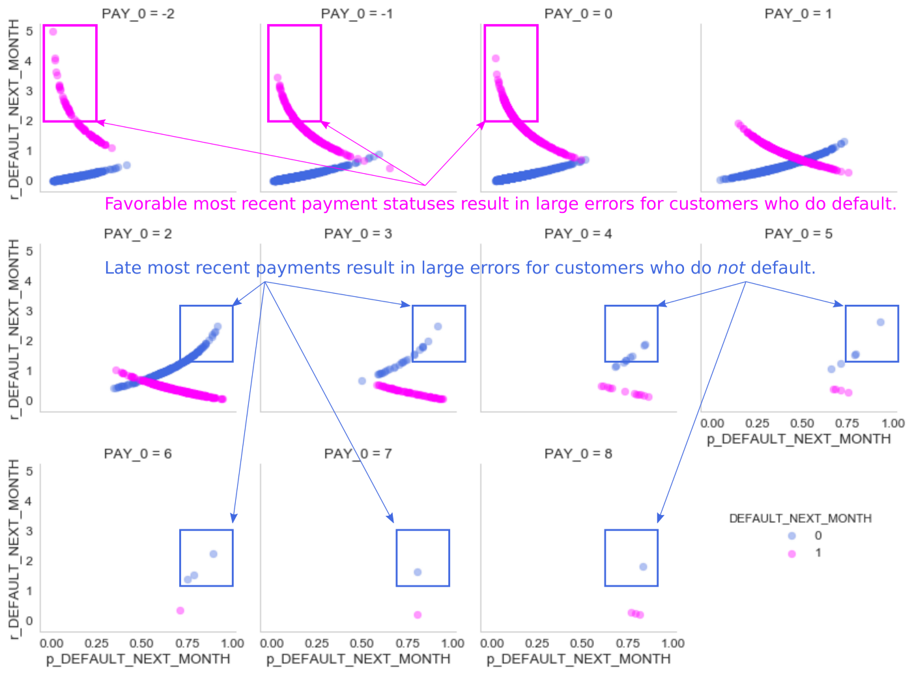

## GWU_DNSC 6290: Course Outline

Materials for a technical, nuts-and-bolts course about increasing transparency, fairness, security and privacy in machine learning.

* Lecture 1: Interpretable Machine Learning Models
* Lecture 2: Post-hoc Explanation
* Lecture 3: Discrimination Testing and Remediation
* Lecture 4: Machine Learning Security
* Lecture 5: Machine Learning Model Debugging
* Lecture 6: Responsible Machine Learning Best Practices

Corrections or suggestions? Please file a [GitHub issue](https://github.com/jphall663/GWU_rml/issues/new).

***

## Lecture 1: Interpretable Machine Learning Models


<sub><sup>**Source:** [Building from Penalized GLM to Monotonic GBM](https://nbviewer.jupyter.org/github/jphall663/GWU_rml/blob/master/lecture_1.ipynb)</sup></sub>

### Lecture 1 Class Materials

* [Syllabus](https://raw.githubusercontent.com/jphall663/GWU_rml/master/Syllabus_PH_Responsible_Machine_Learning_MSBA%20_v4.pdf)
* [Lecture Notes](tex/lecture_1.pdf)
* [Assignment 1](https://raw.githubusercontent.com/jphall663/GWU_rml/master/assignments/tex/assignment_1.pdf) 
  * [Model evaluation notebook](https://nbviewer.jupyter.org/github/jphall663/GWU_rml/blob/master/assignments/eval.ipynb)
  * [Full evaluations results](https://github.com/jphall663/GWU_rml/blob/master/assignmentsmodel_eval_2021_06_11_12_57_26.csv)
* Software Examples:
  * [Building from Penalized GLM to Monotonic GBM](https://nbviewer.jupyter.org/github/jphall663/GWU_rml/blob/master/lecture_1.ipynb?flush_cache=true)
  * [Simple Explainable Boosting Machine Example](https://nbviewer.jupyter.org/github/jphall663/GWU_rml/blob/master/lecture_1_ebm_example.ipynb?flush_cache=true)


### Lecture 1 Suggested Software

* Python [explainable boosting machine (EBM)/GA2M](https://github.com/interpretml/interpret)
* R [`gam`](https://cran.r-project.org/web/packages/gam/index.html)
* `h2o` [penalized GLM](https://docs.h2o.ai/h2o/latest-stable/h2o-docs/data-science/glm.html) (R and Python)
* Monotonic gradient boosting machine (GBM): [`h2o`](https://docs.h2o.ai/h2o/latest-stable/h2o-docs/data-science/algo-params/monotone_constraints.html) and [`xgboost`](https://xgboost.readthedocs.io/en/latest/tutorials/monotonic.html) (R and Python)
* R [`rpart`](https://cran.r-project.org/web/packages/rpart/index.html)
* Python [`skope-rules`](https://github.com/scikit-learn-contrib/skope-rules)

### Lecture 1 Suggested Reading

* **Introduction and Background**: 
  * [*Stop Explaining Black Box Machine Learning Models for High Stakes Decisions and Use Interpretable Models Instead*](https://www.nature.com/articles/s42256-019-0048-x) 
  * **[Responsible Artificial Intelligence](https://www.springer.com/gp/book/9783030303709)** - Sections 2.1-2.5, Chapter 7
  
* **Interpretable Machine Learning Techniques**:
  * **Interpretable Machine Learning** - [Chapter 4](https://christophm.github.io/interpretable-ml-book/simple.html)
  * [*Accurate Intelligible Models with Pairwise Interactions*](http://www.cs.cornell.edu/~yinlou/papers/lou-kdd13.pdf)
  * [*This Looks Like That: Deep Learning for Interpretable Image Recognition*](https://arxiv.org/pdf/1806.10574.pdf)

* **Links from Lecture 1**:
  * [EU AI Regulation Proposal](https://digital-strategy.ec.europa.eu/en/library/proposal-regulation-laying-down-harmonised-rules-artificial-intelligence)
  * [FTC Guidance (2021)](https://www.ftc.gov/news-events/blogs/business-blog/2021/04/aiming-truth-fairness-equity-your-companys-use-ai)

***

## Lecture 2: Post-hoc Explanation


<sub><sup>**Source:** [Global and Local Explanations of a Constrained Model](https://nbviewer.jupyter.org/github/jphall663/GWU_rml/blob/master/lecture_2.ipynb)</sup></sub>

### Lecture 2 Class Materials

* [Lecture Notes](tex/lecture_2.pdf) 
* Software Example: [Global and Local Explanations of a Constrained Model](https://nbviewer.jupyter.org/github/jphall663/GWU_rml/blob/master/lecture_2.ipynb) 
* [Assignment 2](https://raw.githubusercontent.com/jphall663/GWU_rml/master/assignments/tex/assignment_2.pdf) 

### Lecture 2 Suggested Software

* Python:
  * [`allennlp`](https://github.com/allenai/allennlp)
  * [`alibi`](https://github.com/SeldonIO/alibi)
  * [`interpret`](https://github.com/interpretml/interpret)
  * [`shap`](https://github.com/slundberg/shap)
  * [`tf-explain`](https://github.com/sicara/tf-explain)
* R:
  * [`DALEX`](https://cran.r-project.org/web/packages/DALEX/index.html)
  * [`iml`](https://cran.r-project.org/web/packages/iml/index.html)
  
### Lecture 2 Suggested Reading

* **Introduction and Background**: 
  * [*Proposed Guidelines for the Responsible Use of Explainable Machine Learning*](https://arxiv.org/pdf/1906.03533.pdf)
  * [**Responsible Artificial Intelligence**](https://www.springer.com/gp/book/9783030303709) - Chapter 4
  
* **Post-hoc Explanation Techniques**:
  * **Interpretable Machine Learning** - [Chapter 5](https://christophm.github.io/interpretable-ml-book/agnostic.html) and [Chapter 6](https://christophm.github.io/interpretable-ml-book/example-based.html)
  * [*Towards Better Understanding of Gradient-based Attribution Methods for Deep Neural Networks*](https://arxiv.org/pdf/1711.06104.pdf)

***

## Lecture 3: Discrimination Testing and Remediation


<sub><sup>**Source:** [Lecture 3 Notes](tex/lecture_3.pdf)</sup></sub>

### Lecture 3 Class Materials

* [Lecture Notes](tex/lecture_3.pdf) 
* Software Example: [Testing a Constrained Model for Discrimination and Remediating Discovered Discrimination](https://nbviewer.jupyter.org/github/jphall663/GWU_rml/blob/master/lecture_3.ipynb) 
* [Assignment 3](https://raw.githubusercontent.com/jphall663/GWU_rml/master/assignments/tex/assignment_3.pdf) 

### Lecture 3 Suggested Software

Python:

  * [`aequitas`](https://github.com/dssg/aequitas)
  * [`AIF360`](https://github.com/IBM/AIF360)
  * [`Themis`](https://github.com/LASER-UMASS/Themis)
  
### Lecture 3 Suggested Reading

* **Introduction and Background**:

  * **Fairness and Machine Learning** - [Introduction](https://fairmlbook.org/introduction.html)
  * [*Fairness Through Awareness*](https://arxiv.org/pdf/1104.3913.pdf)
  
* **Discrimination Testing and Remediation Techniques**:

  * [*Certifying and Removing Disparate Impact*](https://arxiv.org/pdf/1412.3756.pdf)
  * [*Data Preprocessing Techniques for Classification Without
Discrimination*](https://link.springer.com/content/pdf/10.1007/s10115-011-0463-8.pdf)  
  * [*Decision Theory for Discrimination-aware Classification*](http://citeseerx.ist.psu.edu/viewdoc/download?doi=10.1.1.722.3030&rep=rep1&type=pdf)
  * [*Fairness Beyond Disparate Treatment & Disparate Impact: Learning Classification Without Disparate Mistreatment*](https://arxiv.org/pdf/1610.08452.pdf)
  * [*Learning Fair Representations*](http://proceedings.mlr.press/v28/zemel13.pdf)
  * [*Mitigating Unwanted Biases with Adversarial Learning*](https://dl.acm.org/doi/pdf/10.1145/3278721.3278779)

* **Links from Lecture 3**:
  * [_Model Cards for Model Reporting_](https://arxiv.org/pdf/1810.03993.pdf)
  * [Example Model Cards](https://modelcards.withgoogle.com/model-reports)
  * [GPT-2 Model Card](https://github.com/openai/gpt-2/blob/master/model_card.md) (see also: [_AI deemed ‘too dangerous to release’ makes it out into the world_](https://www.independent.co.uk/life-style/gadgets-and-tech/news/ai-artificial-intelligence-dangerous-text-gpt-2-elon-musk-a9192121.html))
  * [_Millions of black people affected by racial bias in health-care algorithms_](https://www.nature.com/articles/d41586-019-03228-6)
  * [_Insurer’s Use of AI to Study Claims Provokes Uproar After Tweet_](https://www.bloomberg.com/news/articles/2021-05-26/lemonade-s-use-of-ai-to-study-claims-brings-uproar-after-tweet)
  * [Analytics Edge and Data Ethics (DNSC 3288W) Fairness Notes](https://docs.google.com/presentation/d/1KOzva9WvZxlWV_5Ocltot9S5tVu5iVvA_pIdQ0DcRKM/edit) (You may need to request access.)
  * [Dealing with Bias and Fairness in AI/ML/Data Science Systems](https://docs.google.com/presentation/d/17o_NzplYua5fcJFuGcy1V1-5GFAHk7oHAF4dN44NkUE/edit)

***   

## Lecture 4: Machine Learning Security


<sub><sup>**Source:** [Responsible Machine Learning](https://resources.oreilly.com/examples/0636920415947/blob/master/Attack_Cheat_Sheet.png)</sup></sub>

### Lecture 4 Class Materials

* [Lecture Notes](tex/lecture_4.pdf)
* Software Example: [Attacking a Machine Learning Model](https://nbviewer.jupyter.org/github/jphall663/GWU_rml/blob/master/lecture_4.ipynb) 

### Lecture 4 Suggested Software

Python:

  * [`cleverhans`](https://github.com/tensorflow/cleverhans)
  * [`foolbox`](https://github.com/bethgelab/foolbox)
  * [`robustness`](https://github.com/MadryLab/robustness)
  
### Lecture 4 Suggested Reading

* **Introduction and Background**:

  * [*A Marauder’s Map of Security and Privacy in Machine Learning*](https://arxiv.org/pdf/1811.01134.pdf)
  * [BIML Interactive Machine Learning Risk Framework](https://berryvilleiml.com/interactive/)
  * [*The Security of Machine Learning*](https://people.eecs.berkeley.edu/~adj/publications/paper-files/SecML-MLJ2010.pdf)
  * [*Proposals for model vulnerability and security*](https://www.oreilly.com/content/proposals-for-model-vulnerability-and-security/)

  
* **Machine Learning Attacks**:

  * [*Membership Inference Attacks Against Machine Learning Models*](https://arxiv.org/pdf/1610.05820.pdf)
  * [*Stealing Machine Learning Models via Prediction APIs*](https://arxiv.org/pdf/1609.02943.pdf)
  * [*Model Inversion Attacks that Exploit Confidence Information and Basic Countermeasures*](https://dl.acm.org/doi/pdf/10.1145/2810103.2813677)
  * [*Hacking Smart Machines with Smarter Ones: How to Extract Meaningful Data from Machine Learning Classifiers*](https://arxiv.org/pdf/1306.4447.pdf)

* **Links from Lecture 4**:
  * [Mitre Adversarial Threat Matrix](https://github.com/mitre/advmlthreatmatrix)
  * [Robust ML](https://www.robust-ml.org/)   
  * [ISIS 'still evading detection on Facebook', report says](https://www.bbc.com/news/technology-53389657) 
  * [Researchers bypass airport and payment facial recognition systems using masks](https://www.engadget.com/2019-12-16-facial-recognition-fooled-masks.html)
  * [Slight Street Sign Modifications Can Completely Fool Machine Learning Algorithms](https://spectrum.ieee.org/cars-that-think/transportation/sensors/slight-street-sign-modifications-can-fool-machine-learning-algorithms)

***   

## Lecture 5: Machine Learning Model Debugging


<sub><sup>**Source:** [Real-World Strategies for Model Debugging](https://towardsdatascience.com/strategies-for-model-debugging-aa822f1097ce)</sup></sub>

### Lecture 5 Class Materials

* [Lecture Notes](tex/lecture_5.pdf)
* Software Example: [Debugging a Machine Learning Model](https://nbviewer.jupyter.org/github/jphall663/GWU_rml/blob/master/lecture_5.ipynb) 

### Lecture 5 Suggested Software

* [`DALEX`](https://cran.r-project.org/web/packages/DALEX/index.html) (R)
* [`SALib`](https://github.com/SALib/SALib) (Python)
* [`themis-ml`](https://github.com/cosmicBboy/themis-ml) (Python)
* [`What-if Tool`](https://pair-code.github.io/what-if-tool/index.html) (Browser)
  
  
### Lecture 5 Suggested Reading

* **Introduction and Background**:

  * [Debugging Machine Learning Models](https://debug-ml-iclr2019.github.io/)
  * [*Why you should care about debugging machine learning models*](https://www.oreilly.com/radar/why-you-should-care-about-debugging-machine-learning-models/)
  * [*Real-World Strategies for Model Debugging*](https://towardsdatascience.com/strategies-for-model-debugging-aa822f1097ce)

* **Links from Lecture 5**:

***   

## Lecture 6: Responsible Machine Learning Best Practices 
 


<sub><sup>A Responsible Machine Learning Workflow Diagram. **Source:** [*Information*, 11(3) (March 2020)](https://www.mdpi.com/2078-2489/11/3).</sup></sub>

### Lecture 6 Class Materials

* [Lecture Notes](tex/lecture_6.pdf)

### Lecture 6 Suggested Software

* [Awesome Machine Learning Interpretability](https://github.com/jphall663/awesome-machine-learning-interpretability)

### Lecture 6 Suggested Reading

* **Introduction and Background**:

  * [Eight Principles of Responsible Machine Learning](https://ethical.institute/principles.html)
  * [Principles for Accountable Algorithms and a Social Impact Statement for Algorithms](https://www.fatml.org/resources/principles-for-accountable-algorithms)
  * [Responsible AI Practices](https://ai.google/responsibilities/responsible-ai-practices/)
    
* **Links from Lecture 6**:


***   

## Using Class Software Resources

### Mac

**Preliminaries:**

* Install [`homebrew`](https://brew.sh/): `$ /bin/bash -c "$(curl -fsSL https://raw.githubusercontent.com/Homebrew/install/master/install.sh)"`

* Install Java:

```
brew tap adoptopenjdk/openjdk
brew cask install adoptopenjdk8
```

* [Install Mac command line developer tools](https://www.cnet.com/how-to/install-command-line-developer-tools-in-os-x/)

* Install Git: `$ brew install git`

1. Clone this repository with the examples: `$ git clone https://github.com/jphall663/GWU_rml.git`

2. Install Anaconda Python 5.1.0 from the [Anaconda archives](https://repo.continuum.io/archive/) (Anaconda3-5.1.0-MacOSX-x86_64.pkg) and *add it to your system path.* (This means when you type `$ python` at the command prompt, you will start a Python 3.6 session. You should probably check for a line like this `export PATH="/Users/phall/anaconda/bin:$PATH"` in your `.bash_profile` file. You may also need to close and restart your terminal session.)

3. Install `virtualenv`: `$ pip install virtualenv` 
 
4. Change directories into the cloned repository: `$ cd GWU_rml`

5. Create a Python 3.6 virtual environment: `$ virtualenv -p /path/to/anaconda3/bin/python3.6 env_rml` (`/path/to/anaconda3/bin/python3.6` is not a real path. You must replace it with the path to `python3.6` on your system. This can be as simple as `$ virtualenv -p python3.6 env_rml`.) 

6. Activate the virtual environment: `$ source env_rml/bin/activate`

7. Install the correct packages for the example notebooks: `$ pip install -r requirements.txt`

8. Start Jupyter: `$ jupyter notebook`

9. When you are finished, deactivate the environment: `$ deactivate`

If you get stuck, try this link: [Mac Setup: Virtualenv](https://sourabhbajaj.com/mac-setup/Python/virtualenv.html).

### Ubuntu

1. Install [Git](https://git-scm.com/downloads) (`$ sudo apt-get install git`), [Graphviz](https://www.graphviz.org/) (`$ sudo apt-get install graphviz`) and Java (`$ sudo apt-get install openjdk-8-jdk`). They must all be *added to your system path.*

2. Clone this repository with the examples: `$ git clone https://github.com/jphall663/GWU_rml.git`

3. Install Anaconda Python 5.1.0 from the [Anaconda archives](https://repo.continuum.io/archive/) (Anaconda3-5.1.0-Linux-x86_64.sh) and *add it to your system path.* (This means when you type `$ python` at the command prompt, you will start a Python 3.6 session.)

4. Install `virtualenv`: `$ pip install virtualenv` 

5. Change directories into the cloned repository: `$ cd GWU_rml`

6. Create a Python 3.6 virtual environment: `$ virtualenv -p /path/to/anaconda3/bin/python3.6 env_rml` 

7. Activate the virtual environment: `$ source env_rml/bin/activate`

8. Install the correct packages for the example notebooks: `$ pip install -r requirements.txt`

9. Start Jupyter: `$ jupyter notebook`

10. When you are finished, deactivate the environment: `$ deactivate`.

***

Some materials Copyright Patrick Hall and the H2O.ai team 2017-2020.  
